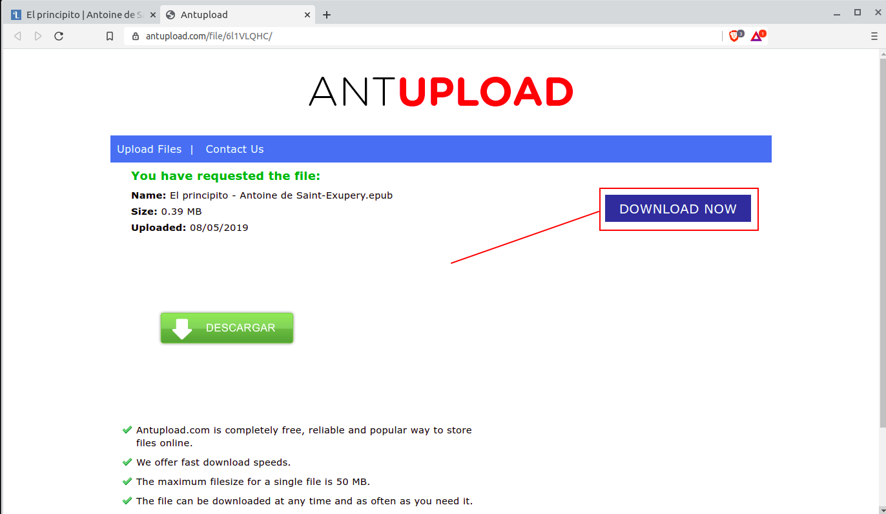

# Cómo descargar libros de Lectulandia

Lectulandia es un sitio de compartición de libros electrónicos en español, completo y actualizado, con un catálogo amplio y organizado y que ha estado activo por un tiempo considerable. La deisponibilidad se ha mantenido estable, por lo que es una buena opción para los amantes de la lectura. El sitio tiene los libros de su catálogo en formatos **epub** y **pdf**, para lectura en computadoras, tablets, teléfonos y también pueden ser convertidos de formato para leerse en dispositivos **Kindle**.

El sitio presenta algo de dificultad para usuarios no muy versados en procedimientos de varios pasos para la descarga del material de lectura, por lo que presento la manera de descargar los libros, saltando las páginas de anuncios y yendo directamente a las descargas.

## A continuación presento los pasos para la descarga de libros desde Lectulandia:

1. Ingresar al sitio [Lectulandia](https://www.lectulandia.co/)

   

2. Busca y selecciona el libro que deseas descargar, por ejemplo, El Principito

   

3. Existen diferentes botones  que indican la liga de descarga de los libros, tanto en formato epub, como en pdf. Los botones correctos para descarga, son los que están el parte de abajo de la portada del libro, que indico en la siguiente imagen:

   

4. Al dar click en el botón de **epub**, se abrirá un apágina de redirección al sitio de descarga, esta pantalla durará unos segundos abierta y posteriormente se abrirá la página real de descarga.
   
   

5. La siguiente es la página de descarga real del libro escogido, atención de dar click en el botón morado del lado derecho que dice "DOWNLOAD NOW", y no en el botón verde de la parte baja de la pantalla.
   
   

6. Se abrirá el diálogo de guardar archivo, seleccionamos guardarlo en el directorio deseado:

   

7. Abrimos el libro con el lector de e-books que tengamos en nuestro sistema:

   

   -------------
   

___

Los libros se pueden descargar en formato **PDF** o formato **epub** y ya una vez descargados se pueden abrir en cualquier dispositivo que permita la lectura de **e-books** en estos formatos.

Para llevar estos libros a un dispositivo **Kindle**, ver [Pasar epub a Kindle](2020-09-01-Comandos-de-vim.md) donde se describe la conversión de formato necesaria para poder ver libros **epub** en un dispositivo **Kindle** de **Amazon**.