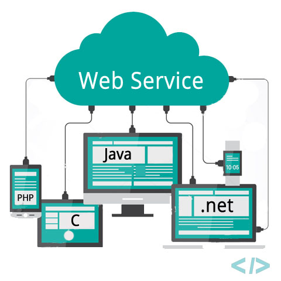

# Qué son los Web Services

El término **Web Services** describe una manera estándar de integrar aplicaciones
basadas en web que utilicen los estándares abiertos de **XML**, **SOAP**, **WSDL** y **UDDI**
sobre un enlace de comunicaciones de protocolo Internet. XML se utiliza para
etiquetar los datos, *SOAP* se utiliza para transferir los datos, *WSDL* se utiliza 
para describir los servicios disponibles y *UDDI* se utiliza para enlistar qué 
servicios están disponibles. Se usan principalmente como un medio de 
comunicación entre negocios y con sus clientes. Los **Web Services** permiten que 
las organizaciones comuniquen sus datos sin tener la necesidad de conocer de 
manera profunda la estructura y funcionamiento interno de los sistemas con los 
que se comunican.

La adopción de este tipo de tecnologías en las organizaciones, se convierte para 
las empresas en una ventaja competitiva, al incrementar las opciones de 
comunicación con otros negocios, clientes y proveedores de una manera estándar, 
lo cual facilita y agiliza las comunicaciones de transacciones y provee un 
ambiente seguro para el tratamiento de información. Este tipo de arquitectura de 
sistemas y comunicaciones de datos representa un cambio en la implementación actual 
que tengan los negocios y se recomienda que estos cambios se hagan den las áreas de 
tecnologías de información de las empresas de forma paulatina (Hagel, Brown, 2001).

---

Los *servicios web* (Web Services), aunque haya empresas que se resistan a su
adopción, son la tendencia en aplicaciones que comparten datos a través de la web.
La resistencia de algunas empresas para integrar el uso de los servicios web sus
procesos de negocios, se debe en gran parte a los cambios que este cambo de
estrategia implican dentro de sus departamentos de tecnologías de información, así 
como de los cambios en los procesos en sí mismos.

Entre los cambios que se presentan dentro de una organización, el impacto es en 
las áreas de tecnologías de información, gerenciales y de desarrollo de nuevas
habilidades para su mejor aprovechamiento. Como ejemplos de estos cambios podemos 
mencionar los siguientes:

- Los departamentos de tecnologías de información necesitarán moverse en dos
direcciones simultáneamente, contratar servicios externos para muchas
actividades tradicionales de tecnologías de información mientras se hace una
mejora interna en las habilidades de diseño de servicios web que puedan
venderse a otras empresas.
- Los departamentos de tecnologías de información necesitarán la integración de
un nuevo conjunto de habilidades en áreas tales como arquitectura de
aplicaciones empresariales, desarrollo de aplicaciones, seguridad y
operaciones de tecnologías de información.
- Las operaciones y el desempeño de las tecnologías de información
incrementarán su dependencia are integración efectiva de recursos externos.
- Los departamentos de tecnologías de información necesitarán tomar el
liderazgo en la definición de estándares que se requieran para que las
comunidades de industrias y negocios operen de manera efectiva.

La integración de las tecnologías de *servicios web* a los procesos de negocios se
puede efectuar de manera sencilla debido a que este tipo de tecnologías utiliza
estándares de comunicación como ya se mencionó, los cuales facilitan la integración 
de las aplicaciones de comercio electrónico que tienen la necesidad de intercambiar 
datos entre empresas, con clientes y proveedores.

La factibilidad de uso de las tecnologías de *servicios web* es muy alta, y no debe 
ser considerada para su integración de manera local o regional, sino que permite 
que su uso tenga un alcance a nivel de Internet.

El uso de este tipo de servicios es generalizado, aunque, por el hecho de pertenecer 
a una capa de middleware en su arquitectura, no es muy conocido a nivel de usuario.
La mayoría de las aplicaciones bancarias que la gente usa desde Internet, teléfonos, 
cajeros automáticos, terminales de ventanilla en las sucursales bancarias, tienen 
una base en servicios web por medio de los cuales se comunican para hacer un 
intercambio de información de las transacciones solicitadas.

Existen muchos ejemplos de uso de los servicios web para el manejo de transacciones 
y consulta de operaciones de datos en actividades de compra venta entre negocios, 
con sus clientes y proveedores.

Otro ejemplo muy difundido del uso de servicios web que opera a nivel nacional en 
**México** es el del pago de impuestos a través de Internet en la [Secretaría de 
Administración Tributaria (SAT)](https://www.sat.gob.mx/home), el cual, por medio del sistema integral de 
comprobantes fiscales, en su módulo de verificación, provee a los contribuyentes 
un servicio web para verificar la validez de los folios de los comprobantes 
fiscales digitales, al cual se puede acceder por medio de la página web de la 
Secretaría.

Los servicios web pueden ser utilizados tanto en el ámbito comercial como en el de 
gobierno para integrar las plataformas de datos y su comunicación de una manera 
estándar, la cual permite exponer una interfaz pública para consultar o modificar 
datos, ocultando información y procesos de manejo interno de los datos y de su 
almacenamiento. Las organizaciones que adoptan el uso de los servicios web tienen 
una ventaja competitiva al proporcionar una mayor facilidad de uso para sus clientes, 
garantizando la seguridad y privacidad de la información que es comunicada por medio 
de estos servicios.

El uso de los servicios web, desde el punto de vista tecnológico facilitar la 
integración de diferentes plataformas de usuarios tales como teléfonos celulares 
con internet, computadoras y otros tipos de terminales; y de diferentes sistemas 
operativos tales como Windows, UNIX, Linux, IOS, lo cual permite hacer un desarrollo 
único, montarlo en un servidor de aplicaciones que cumpla con los estándares de los 
servicios web y al publicar su interfaz, ya se tienen disponibles los servicios que 
provee para que los clientes los consuman, sin la necesidad de hacer desarrollos 
específicos para las diferentes plataformas.

Bibliografía
- Your next IT strategy. Hagel III, John. Seely Brown, John. Harvard Business Reviewd, 2001
- Metro Web Services Overview.
<http://www.oracle.com/technetwork/java/index-jsp-137004.html>
- Web Services.
<http://www.webopedia.com/TERM/W/Web_Services.html>
- Service Oriented Java Business Integration.
<https://www.packtpub.com/application-development/service-oriented-java-business-integration>
- SICOFI (Sistema Integral de Comprobantes Fiscales) – Verificación.
<ftp://ftp2.sat.gob.mx/asistencia_ftp/publicaciones/cfd/Manual_Usuario_Validador.pdf>