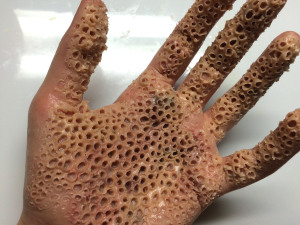
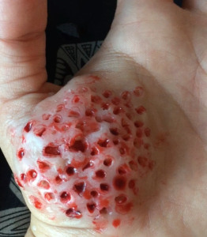

# ¿Qué es la tripofobia?

La **tripofobia** es muy común en los humanos, pero es poco conocida. *Es el miedo patológico a las figuras geométricas formadas por agujeros o dibujos repetidos y próximos de orificios en grandes cantidades sobre una superficie, normalmente de apariencia asimétrica y especialmente orgánica*. Algunas personas manifiestan auténtico pánico, náuseas y sudores fríos cuando ven un montón de espuma con burbujas, un traje de lunares, una flor de loto, un panal de abejas, un puñado de troncos apilados, un ladrillo o una tableta de chocolate con burbujas. Este trastorno podría tener un origen evolutivo, según sugiere un nuevo estudio que publicó la Universidad de Essex en la revista *Psychological Science*.

La fobia a los agujeros o patrones repetitivos puede ser más frecuente de lo que imaginamos. En un estudio previo realizado a través de Internet, *Geoff Cole* y *Arnold Wilkins* identificaron razones tripofóbicas en un 16% de los sujetos que participaron.Este miedo a los agujeros o a los dibujos repetidos no tienen un motivo. A diferencia de otro tipo de fobias como puede ser la agorafobia por nombrar un ejemplo, la **tripofobia** puede presentarse a cualquier persona sin que exista un motivo en su pasado que le provoque un trauma y por ello se genere el inicio de la fobia.

## Un estudio sobre el miedo a los agujeros

En al caso de este miedo a los agujeros o patrones repetitivos el origen, si bien no está claro, existen artículos ingleses de 2013 que analizan el tema (esto da la idea de que el tema es considerablemente reciente), la **tripofobia** podría tener su origen, de acuerdo al artículo mencionado, que dejamos aquí [Fear of holes](http://pss.sagepub.com/content/24/10/1980), el artículo está en inglés. El origen de este trastorno molesto e incómodo podría estar arraigado en nuestros genes como un recuerdo instintivo para alejarnos de aquello que pueda dañarnos.

De acuerdo con Geoff Cole, uno de los autores del artículo antes mencionado, el motivo según sus hipótesis está en los patrones visuales que causan la **tripofobia** tienen por lo general bastante en común con las manchas que tienen en la piel los animales venenosos. Muchos de estos animales tienen marcas muy visibles y vistosas en su cuerpo, las ranas con colores brillantes y patrones geométricos en sus manchas, las setas venenosas, una cobra en su cuerpo, una serpiente de coral… todos esos animales tienen en común, entre otras cosas, que son venenosos, tienen patrones de agujeros o manchas que pueden tener inconscientemente cierta similitud con agujeros, y que pueden matarte rápidamente sino te alejas de ellos.
Es normal entonces que evolutivamente esta fobia o miedo siga en nuestros genes ya que aquellos individuos que la tenían, era más probable que sobrevivieran con éxito ya que se exponían a menos riesgos ante estas criaturas. Lo que hizo que con el paso de las generaciones, esa fobia a los agujeros se convirtiera en una ventaja evolutiva. Desagradable para quien la tiene, sí, pero eficaz. Y al fin y al cabo en la naturaleza lo que importaba era el resultado. Mantenerte a salvo.

## Referencias

- [La tropofobia puede tener un origen evolutivo](http://www.muyinteresante.es/salud/articulo/la-tripofobia-o-miedo-a-los-agujeros-podria-tener-una-explicacion-evolutiva-891378205763)
- [Tripofobia- psicología](https://psicologiamotivacional.com/tripofobia-fobia-agujeros/)
- [Fear of holes - University of Essex](http://pss.sagepub.com/content/24/10/1980)